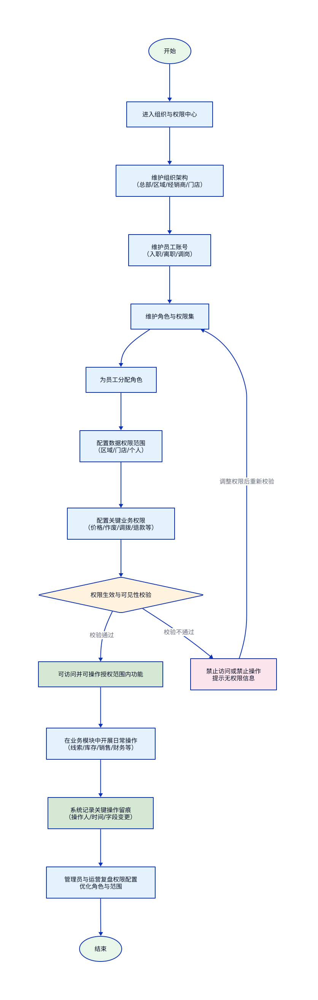
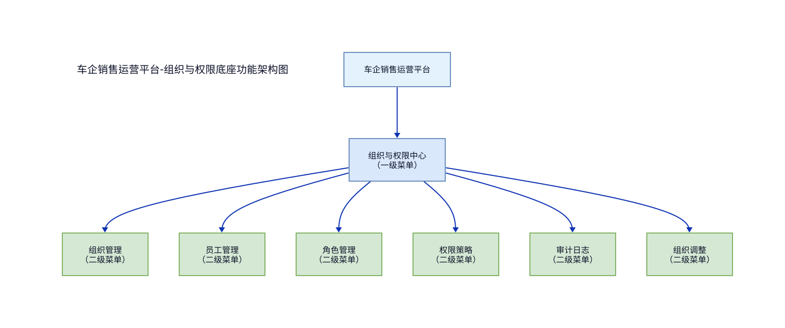
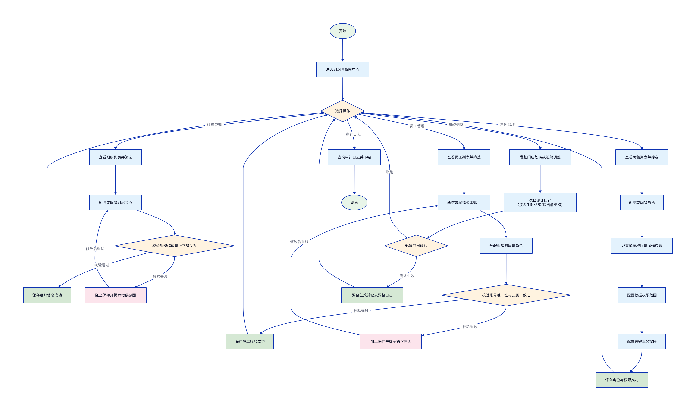
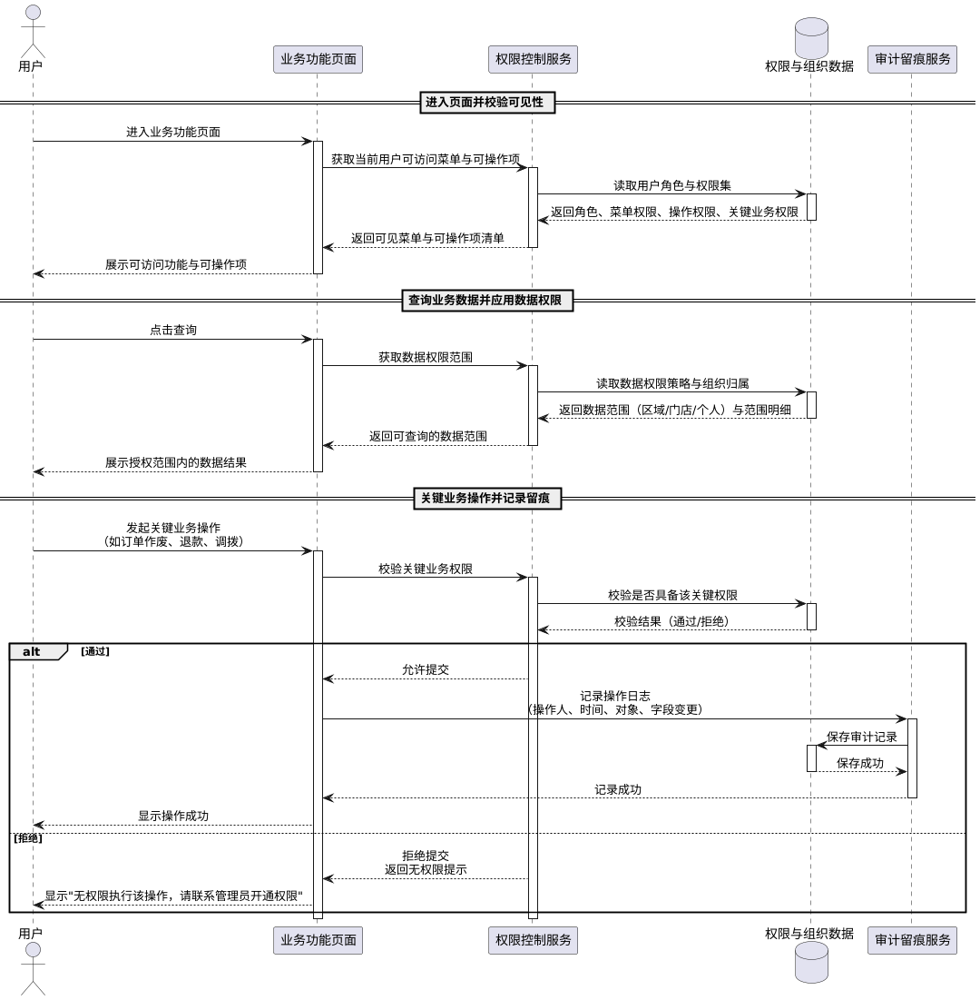

## 一、文档信息

| 项目名称 | 车企销售运营平台 |
|---------|------------------|
| 文档版本 | V1.0 |
| 编制日期 | 2026-05-08 |
| 编制人 | - |
| 审核人 | - |
| 批准人 | - |
| 客户单位 | 主机厂 |
| 编制单位 | 主机厂 |
| 适用范围 | 组织与权限底座模块（组织架构、员工账号、角色与权限、数据权限、审计留痕、组织调整） |
| 核心目标 | 建立统一的组织与权限体系，保障跨总部/区域/经销商/门店的业务协同与数据口径一致 |
| 文档状态 | 草稿 |

**历史版本**

| 版本 | 日期 | 作者 | 更改说明 |
|-----|------|------|---------|
| V1.0 | 2026-05-08 | - | 初始版本 |

---

## 二、项目概述

### 2.1 项目背景

车企销售运营平台面向总部、区域、经销商与门店多层级组织协同运行，业务覆盖线索到成交再到回款、交付与车主运营。由于参与主体多、组织层级深、权限边界复杂，若缺少统一的组织与权限底座，将导致跨层级协作效率低、数据口径不一致、关键操作缺少留痕等问题，进而影响总部经营监控与精细化运营。

1. **组织边界不清**：总部/区域/经销商/门店之间的数据隔离与下钻范围缺少统一规则，造成“看得到/看不到”的争议与风险。
2. **权限口径不一致**：菜单权限、操作权限、数据权限与关键业务权限分散配置，难以形成可复用的角色体系，新增组织或人员时配置成本高。
3. **关键操作不可追溯**：价格、作废、调拨、退款等关键业务操作若缺少审计留痕，难以支撑合规要求与事后追责。
4. **组织变更影响不可控**：门店划转、人员调岗等组织变更会影响数据归属与报表统计口径，需要在变更发生时明确策略并可追溯。

为解决上述问题，建设组织与权限底座模块，统一组织架构、权限模型与数据权限策略，为各业务域提供一致的访问控制与审计能力。

### 2.2 项目建设目标

本模块建设目标如下：

1. **统一组织架构与人员归属**：支持总部→区域→经销商→门店→员工多级组织维护，明确人员归属与上下级关系，支撑跨层级管理与业务协同。
2. **形成可复用的角色与权限体系**：建立菜单权限、操作权限、数据权限与关键业务权限的统一模型，支持按角色批量授权与快速复制，降低权限配置成本。
3. **保障默认数据隔离与可控放开**：以经销商隔离、门店仅看本店、个人仅看本人为默认原则，并支持按角色配置放开范围，满足总部全局视角与区域下钻需求并存。
4. **实现关键操作全量留痕**：对关键单据与财务相关操作记录操作人、时间、对象与字段变更，支持按条件检索与审计复核。
5. **支持组织调整并明确统计口径**：门店划转、组织合并等变更时，必须选择历史数据统计口径（按发生时组织/按当前组织），并形成可追溯记录。

### 2.3 项目建设范围

**系统端**：
- PC端管理后台（Web应用）

**功能范围**：
- 组织管理：组织层级与基础信息维护
- 员工管理：员工账号、归属与状态维护
- 角色管理：角色维护、授权与复制
- 权限策略：菜单/操作/数据/关键业务权限配置与校验
- 审计日志：关键操作留痕查询与下钻
- 组织调整：门店划转与历史口径策略管理

**不包含的功能**：
- 单点登录、多因素认证、外部身份源对接（预留扩展，后续迭代）

### 2.4 业务流程图

### 2.5 业务角色定义

| 角色名称 | 角色描述 | 主要职责 | 权限范围 |
|---------|---------|---------|---------|
| 总部系统管理员 | 负责组织与权限体系维护 | 组织维护、账号维护、角色与权限配置、审计复核 | 全部功能与全量数据 |
| 总部运营 | 负责运营管理与指标监控 | 查看全局数据、配置部分运营相关权限 | 跨区域查看（按授权）、无组织结构变更权限 |
| 区域运营 | 区域层级管理与指导 | 查看区域范围数据、管理区域下组织与人员（按授权） | 仅本区域数据 |
| 经销商管理员 | 经销商侧系统管理员 | 维护经销商及门店人员、分配角色 | 仅本经销商数据 |
| 门店店长/经理 | 门店经营管理 | 审批、分配线索、查看门店数据 | 仅本门店数据（可放开到个人维度） |
| 业务人员 | 日常业务处理人员 | 业务录入、查询、跟进与处理 | 仅本人或被授权的数据范围 |

---

## 三、项目建设内容

### 3.1 总体功能架构

**菜单结构文字说明：**
- 组织与权限中心（一级菜单）
  - 组织管理（二级菜单）
  - 员工管理（二级菜单）
  - 角色管理（二级菜单）
  - 权限策略（二级菜单）
  - 审计日志（二级菜单）
  - 组织调整（二级菜单）

### 3.2 需求功能清单

| 序号 | 业务需求 | 需求概述 | 优先级 |
|-----|---------|---------|-------|
| 1 | 组织架构管理 | 维护总部/区域/经销商/门店多级组织，支持启用/停用与层级关系约束 | P0 |
| 2 | 员工账号与归属管理 | 维护员工账号、归属组织、岗位与状态，支持调岗与离职处理 | P0 |
| 3 | 角色与授权管理 | 维护角色并配置菜单权限、操作权限与关键业务权限，支持复制与批量授权 | P0 |
| 4 | 数据权限策略 | 支持区域/门店/个人等数据范围控制，默认隔离并可按角色放开 | P0 |
| 5 | 权限校验与可见性 | 无权限时禁止访问且隐藏不可用操作，避免越权与误操作 | P0 |
| 6 | 关键业务权限控制 | 对价格、作废、调拨、退款等关键动作进行独立授权与审计 | P0 |
| 7 | 审计留痕 | 对关键单据与财务相关操作记录完整留痕，可按条件检索与导出 | P0 |
| 8 | 组织调整与口径策略 | 门店划转等变更必须选择历史统计口径策略并形成可追溯记录 | P1 |
| 9 | 权限配置校验 | 权限配置冲突与越权配置在保存时提示并阻止 | P1 |

### 3.3 页面功能清单

| 一级菜单 | 二级菜单 | 子功能 | 功能描述 |
|---------|---------|-------|---------|
| 组织与权限中心 | 组织管理 | 筛选 | 按组织类型、名称、状态筛选 |
| ^ | ^ | 列表 | 分页展示组织节点列表，支持查看上下级关系 |
| ^ | ^ | 新增 | 新增组织节点并选择上级组织 |
| ^ | ^ | 编辑 | 修改组织基础信息与负责人信息 |
| ^ | ^ | 启用/停用 | 对组织节点启用或停用，停用后受控影响下游可用范围 |
| ^ | 员工管理 | 筛选 | 按组织、姓名/工号、账号状态筛选 |
| ^ | ^ | 列表 | 分页展示员工账号与归属信息 |
| ^ | ^ | 新增 | 新增员工账号并设置归属组织与岗位信息 |
| ^ | ^ | 编辑 | 修改员工基础信息、归属与岗位信息 |
| ^ | ^ | 启用/停用 | 启用或停用员工账号，停用后禁止登录与操作 |
| ^ | ^ | 分配角色 | 为员工分配一个或多个角色 |
| ^ | 角色管理 | 筛选 | 按角色名称、状态筛选 |
| ^ | ^ | 列表 | 分页展示角色列表与授权摘要 |
| ^ | ^ | 新增 | 新增角色并配置权限 |
| ^ | ^ | 编辑 | 修改角色信息与权限配置 |
| ^ | ^ | 启用/停用 | 启用或停用角色，停用后关联账号权限随之失效 |
| ^ | ^ | 复制角色 | 基于已有角色复制生成新角色并可调整权限 |
| ^ | 权限策略 | 查看 | 查看菜单权限、操作权限、数据权限与关键业务权限配置摘要 |
| ^ | ^ | 配置数据权限 | 配置默认数据隔离原则与各角色数据范围策略 |
| ^ | ^ | 配置关键业务权限 | 配置价格、作废、调拨、退款等关键权限项的授权范围 |
| ^ | 审计日志 | 筛选 | 按操作人、对象类型、时间范围、动作类型筛选 |
| ^ | ^ | 列表 | 分页展示审计记录，支持查看字段变更明细 |
| ^ | ^ | 导出 | 将当前筛选结果导出为文件 |
| ^ | 组织调整 | 发起调整 | 发起门店划转/组织合并等调整申请并填写影响范围 |
| ^ | ^ | 选择口径 | 选择历史数据统计口径策略（按发生时组织/按当前组织） |
| ^ | ^ | 确认生效 | 确认后变更生效并记录调整日志 |

### 3.4 页面访问权限

| 功能模块 | 总部系统管理员 | 总部运营 | 区域运营 | 经销商管理员 | 门店店长/经理 | 业务人员 |
|---------|---------------|---------|---------|-------------|--------------|---------|
| 组织管理 | 全部权限 | 查看 | 查看（本区域） | 全部权限（本经销商） | 查看（本门店） | 无 |
| 员工管理 | 全部权限 | 查看 | 全部权限（本区域） | 全部权限（本经销商） | 查看（本门店） | 无 |
| 角色管理 | 全部权限 | 查看 | 无（默认） | 全部权限（本经销商） | 无（默认） | 无 |
| 权限策略 | 全部权限 | 查看 | 无（默认） | 查看/配置（本经销商） | 无（默认） | 无 |
| 审计日志 | 全部权限 | 查看 | 查看（本区域） | 查看（本经销商） | 查看（本门店） | 无 |
| 组织调整 | 全部权限 | 无（默认） | 发起/查看（本区域，按授权） | 发起/查看（本经销商，按授权） | 无（默认） | 无 |

### 3.5 功能详细设计

### 3.5.1 组织与权限底座

#### （一）功能需求概述

组织与权限底座用于统一维护多级组织、员工账号与角色权限模型，并为各业务模块提供一致的数据权限边界与关键操作控制，同时记录关键操作留痕，支撑合规审计与经营管理。

#### （二）功能设计

**1）组织管理**

**筛选**

支持以下条件筛选，条件之间为“与”关系，点击搜索触发查询：

| 筛选字段 | 类型 | 说明 |
|---------|------|------|
| 组织类型 | 下拉选择 | 总部/区域/经销商/门店 |
| 组织名称 | 文本输入 | 支持模糊搜索 |
| 状态 | 下拉选择 | 启用/停用 |
| 上级组织 | 层级选择 | 选择上级节点，查看其下属组织 |

**列表**

| 列名 | 字段类型 | 说明 |
|-----|---------|------|
| 组织名称 | 文本 | - |
| 组织类型 | 文本 | - |
| 上级组织 | 文本 | 顶层组织显示“-” |
| 负责人 | 文本 | 无值显示“-” |
| 状态 | 文本 | 启用/停用 |
| 操作 | 操作按钮 | 编辑、启用/停用（无权限时隐藏） |

列表为空时显示：暂无组织数据。

**新增**

点击“新增”进入新建组织页面（或弹出编辑窗口）。

| 字段名称 | 类型 | 长度限制 | 必填 | 默认值 | 说明 |
|---------|------|---------|------|-------|------|
| 组织名称 | 文本输入 | 2-50字 | 是 | - | 同一上级下不允许重名 |
| 组织编码 | 文本输入 | 2-30字 | 是 | - | 系统内唯一 |
| 组织类型 | 下拉选择 | - | 是 | - | 总部/区域/经销商/门店 |
| 上级组织 | 层级选择 | - | 是 | - | 顶层组织的上级为“无” |
| 负责人 | 文本输入 | 0-30字 | 否 | - | - |
| 联系电话 | 文本输入 | 0-20字 | 否 | - | - |
| 备注 | 文本输入 | 0-200字 | 否 | - | - |

提交成功：新增成功。

**编辑**

点击“编辑”，自动填入当前记录数据，表单字段同新增（组织类型与上级组织的可编辑性由管理员策略决定）。

提交成功：更新成功。

**启用/停用**

点击状态切换后生效：

- 停用组织时，若存在启用状态的下级组织，阻止停用，提示“该组织存在启用的下级组织，无法停用”。
- 停用组织时，若组织下存在启用状态的员工账号，阻止停用，提示“该组织下存在启用的员工账号，无法停用”。
- 停用成功：状态已更新。

**业务规则**

- 组织编码在系统内全局唯一。新增/编辑时若重复，阻止提交，提示“组织编码【XXX】已存在，请更换”。
- 组织类型与层级关系需满足约束：总部只能作为顶层；门店不能作为上级。违反时阻止提交，提示“组织层级关系不合法，请调整上级组织”。

**2）员工管理**

**筛选**

支持以下条件筛选，条件之间为“与”关系：

| 筛选字段 | 类型 | 说明 |
|---------|------|------|
| 所属组织 | 层级选择 | 选择组织节点，查询其范围内员工 |
| 姓名/工号 | 文本输入 | 支持模糊搜索 |
| 账号状态 | 下拉选择 | 启用/停用 |
| 角色 | 下拉选择 | 按已分配角色筛选 |

**列表**

| 列名 | 字段类型 | 说明 |
|-----|---------|------|
| 姓名 | 文本 | - |
| 工号 | 文本 | 无值显示“-” |
| 所属组织 | 文本 | 显示到门店或最末级组织 |
| 岗位 | 文本 | 无值显示“-” |
| 账号 | 文本 | 系统登录账号 |
| 角色 | 文本 | 多个角色以逗号分隔展示 |
| 状态 | 文本 | 启用/停用 |
| 操作 | 操作按钮 | 编辑、启用/停用、分配角色（无权限时隐藏） |

列表为空时显示：暂无员工数据。

**新增**

点击“新增”进入新建员工页面（或弹出编辑窗口）。

| 字段名称 | 类型 | 长度限制 | 必填 | 默认值 | 说明 |
|---------|------|---------|------|-------|------|
| 姓名 | 文本输入 | 2-30字 | 是 | - | - |
| 工号 | 文本输入 | 0-30字 | 否 | - | 同一组织下不允许重复（可配置） |
| 手机号 | 文本输入 | 0-20字 | 否 | - | 用于找回账号（可选） |
| 账号 | 文本输入 | 4-30字 | 是 | - | 系统内唯一 |
| 初始密码 | 文本输入 | 8-20字 | 是 | - | 支持一键生成（可选） |
| 所属组织 | 层级选择 | - | 是 | - | 员工归属组织 |
| 岗位 | 文本输入 | 0-30字 | 否 | - | - |
| 账号状态 | 下拉选择 | - | 是 | 启用 | 启用/停用 |

提交成功：新增成功。

**编辑**

点击“编辑”，自动填入当前记录数据。账号字段默认不可修改（如需修改需单独权限）。

提交成功：更新成功。

**启用/停用**

- 停用账号后，该账号禁止登录与操作。
- 停用成功：状态已更新。

**分配角色**

为员工分配一个或多个角色。保存后立即生效（生效规则见“权限策略”）。

**业务规则**

- 账号在系统内全局唯一。新增/编辑时若重复，阻止提交，提示“账号【XXX】已存在，请更换”。
- 员工仅允许归属到经销商或门店（或管理员允许的组织类型）。不满足时阻止提交，提示“所属组织不支持分配员工，请重新选择”。
- 账号被停用后，系统待办与通知不再分配给该账号；已分配任务需由业务模块按其规则完成交接处理。

**3）角色管理**

**筛选**

| 筛选字段 | 类型 | 说明 |
|---------|------|------|
| 角色名称 | 文本输入 | 支持模糊搜索 |
| 状态 | 下拉选择 | 启用/停用 |
| 适用层级 | 下拉选择 | 总部/区域/经销商/门店（可选） |

**列表**

| 列名 | 字段类型 | 说明 |
|-----|---------|------|
| 角色名称 | 文本 | - |
| 角色编码 | 文本 | 无值显示“-” |
| 适用层级 | 文本 | 用于限制该角色可分配对象（可配置） |
| 状态 | 文本 | 启用/停用 |
| 操作 | 操作按钮 | 编辑、启用/停用、复制角色（无权限时隐藏） |

列表为空时显示：暂无角色数据。

**新增/编辑**

| 字段名称 | 类型 | 长度限制 | 必填 | 默认值 | 说明 |
|---------|------|---------|------|-------|------|
| 角色名称 | 文本输入 | 2-50字 | 是 | - | 同一可见范围内不允许重名 |
| 角色编码 | 文本输入 | 2-30字 | 否 | - | 系统内唯一（建议填写） |
| 角色描述 | 文本输入 | 0-200字 | 否 | - | - |
| 适用层级 | 下拉选择 | - | 否 | - | 限制该角色可分配到哪些组织层级的员工 |
| 状态 | 下拉选择 | - | 是 | 启用 | 启用/停用 |

提交成功：保存成功。

**配置权限**

角色权限由以下四类组成：

1. 菜单权限：决定可进入的一级/二级菜单
2. 操作权限：决定在页面内可执行的具体操作（如新增、编辑、删除、导出、分配等）
3. 数据权限：决定可查询与可处理的数据范围（区域/门店/个人等）
4. 关键业务权限：决定是否允许执行价格、作废、调拨、退款等关键动作

保存成功：保存成功。

**复制角色**

点击“复制角色”后生成新角色，自动填入被复制角色的权限配置，新角色默认命名规则：原角色名称-副本（可编辑）。

复制成功：复制成功。

**启用/停用**

- 停用角色后，与该角色关联的员工账号不再获得该角色的任何权限。
- 停用成功：状态已更新。

**业务规则**

- 角色名称在同一可见范围内唯一。新增/编辑时若重复，阻止提交，提示“角色名称【XXX】已存在，请更换”。
- 角色编码在系统内全局唯一。新增/编辑时若重复，阻止提交，提示“角色编码【XXX】已存在，请更换”。
- 若角色被大量账号使用，编辑权限后即时生效，需记录审计留痕（详见“审计日志”）。

**4）权限策略**

权限策略用于定义默认数据隔离原则、角色数据范围策略，以及权限生效与校验规则。

**默认数据隔离原则**

- 经销商之间默认不可互看。
- 门店默认仅可查看本店数据。
- 个人默认仅可查看本人客户与本人单据。
- 可按角色配置放开范围（例如区域运营可查看本区域，或总部可全局查看）。

**数据权限范围配置**

数据范围策略支持以下值（各业务模块统一解释）：

| 数据范围 | 说明 |
|---------|------|
| 全部数据 | 可查看与处理全量数据（仅总部类角色默认可用） |
| 区域 | 仅限指定区域及其下属组织范围 |
| 经销商 | 仅限指定经销商及其下属门店范围 |
| 门店 | 仅限指定门店范围 |
| 个人 | 仅限本人范围（本人名下客户、本人创建或负责人单据） |

保存成功：保存成功。

**权限生效规则**

- 当员工拥有多个角色时，菜单权限与操作权限按“合并”生效；数据权限按“并集”生效；关键业务权限按“任一角色具备即具备”生效（可配置为“全部角色需具备”）。
- 无权限的菜单禁止访问，提示“无权访问该功能，请联系管理员开通权限”。
- 无权限的操作项不展示，避免误操作入口。

**权限配置校验**

- 若为员工分配的角色不满足其所属组织层级限制，阻止保存，提示“该角色不适用于当前员工所属组织层级，请调整角色或组织归属”。
- 若配置了跨经销商的数据范围，且操作者不具备对应授权，阻止保存，提示“当前账号无权限配置跨经销商数据范围”。

**关键业务权限项**

关键业务权限用于对高风险操作进行独立授权，默认不随普通操作权限自动放开：

| 权限项 | 说明 |
|-------|------|
| 价格相关权限 | 允许低于底价或低于政策价的成交（由业务模块触发控制） |
| 作废/反作废权限 | 允许对关键单据执行作废与反作废 |
| 调拨审批权限 | 允许发起/审批跨门店或跨经销商调拨 |
| 退款审批权限 | 允许发起/审批退款并联动业务状态回滚 |

关键业务权限被拒绝时提示：“无权限执行该操作，请联系管理员开通权限”。

**5）审计日志**

审计日志用于记录关键单据与财务相关操作的全量留痕，并支持检索、下钻与导出。

**筛选**

支持以下条件筛选，条件之间为“与”关系：

| 筛选字段 | 类型 | 说明 |
|---------|------|------|
| 操作人 | 文本输入 | 支持按姓名/账号模糊搜索 |
| 操作组织 | 层级选择 | 操作人所属组织 |
| 对象类型 | 下拉选择 | 组织/员工/角色/权限策略/关键单据/财务操作等 |
| 对象编号 | 文本输入 | 业务对象编号或标识（如有） |
| 动作类型 | 下拉选择 | 新增/编辑/启用/停用/授权/撤销/作废/审批等 |
| 操作时间 | 日期范围 | - |

**列表**

| 列名 | 字段类型 | 说明 |
|-----|---------|------|
| 操作时间 | 文本 | - |
| 操作人 | 文本 | - |
| 操作组织 | 文本 | - |
| 对象类型 | 文本 | - |
| 对象名称/编号 | 文本 | 无值显示“-” |
| 动作类型 | 文本 | - |
| 结果 | 文本 | 成功/失败 |
| 操作 | 操作按钮 | 查看变更明细（无权限时隐藏） |

**查看变更明细**

支持展示字段变更清单：

| 字段名 | 变更前 | 变更后 | 说明 |
|-------|-------|-------|------|
| - | - | - | 无变更字段不展示 |

**导出**

点击“导出”，将当前筛选结果导出为文件。
导出成功：导出成功。

**业务规则**

- 对权限、角色、数据权限、关键业务权限的新增/编辑/启用/停用操作必须记录留痕，留痕字段至少包含：操作者、操作时间、对象类型、对象标识、动作类型、变更字段明细、结果。
- 对关键单据与财务相关操作的留痕范围由各业务模块定义，但留痕查询入口统一在本模块提供。

**6）组织调整**

组织调整用于处理门店划转、组织合并等组织结构变更，并在变更发生时明确历史数据统计口径。

**发起调整**

| 字段名称 | 类型 | 必填 | 说明 |
|---------|------|------|------|
| 调整类型 | 下拉选择 | 是 | 门店划转/组织合并/组织拆分（可扩展） |
| 原组织 | 层级选择 | 是 | 变更前组织 |
| 目标组织 | 层级选择 | 是 | 变更后组织 |
| 生效日期 | 日期选择 | 是 | 生效后按新组织结构运行 |
| 影响范围说明 | 文本输入 | 是 | 说明涉及的门店、员工、业务范围 |
| 统计口径策略 | 下拉选择 | 是 | 按发生时组织/按当前组织 |
| 备注 | 文本输入 | 否 | - |

提交成功：提交成功。

**确认生效**

- 生效前可撤销调整。撤销确认文案：“确认撤销该组织调整吗？”撤销成功：撤销成功。
- 生效后不可编辑调整单。尝试编辑提示：“该调整已生效，无法修改”。

**业务规则**

- 调整类型为“门店划转”时，原组织与目标组织必须为门店或门店的直接上级组织。否则阻止提交，提示“组织类型不匹配，无法发起该调整”。
- 生效日期不得早于当前日期。否则阻止提交，提示“生效日期不能早于当前日期”。
- 统计口径策略必须在调整发起时明确：未选择时阻止提交，提示“请选择历史数据统计口径策略”。
- 统计口径策略影响报表与下钻口径：按发生时组织表示历史数据保持原归属，按当前组织表示历史数据随组织结构变化归属到新组织。

#### （三）业务逻辑关联

- 依赖关系：本模块为线索、库存、销售、财务、用户运营、报表等模块提供组织结构、人员归属、角色与权限、数据范围策略与关键业务权限项。
- 影响关系：组织节点启用/停用、员工账号启用/停用、角色权限变更会影响其他模块的可见菜单、可操作项、可处理数据范围与审批/待办分配。
- 影响关系：组织调整的统计口径策略会影响报表中心与总部驾驶舱的历史统计口径与下钻范围。
- 影响关系：关键业务权限项的授权变化会影响其他模块对高风险操作的放行与审批链路触发条件。

#### （四）用户操作流程图

#### （五）功能时序图

---

## 四、安全与控制要求（本模块）

### 4.1 身份认证

- 系统用户使用账号密码登录。
- 账号被停用后禁止登录，提示“账号已停用，请联系管理员”。
- 连续多次登录失败可触发安全策略（如锁定账号），提示“账号或密码错误，请重试”。

### 4.2 权限控制

- 基于角色的访问控制：菜单权限控制可访问菜单；操作权限控制可执行操作；数据权限控制可查询与可处理范围；关键业务权限控制高风险操作。
- 无权限访问页面时禁止进入并提示“无权访问该功能，请联系管理员开通权限”。
- 无权限操作项不展示，避免误操作入口。

### 4.3 数据隔离

- 经销商之间默认不可互看；门店默认仅看本店；个人默认仅看本人。
- 当被授权跨层级下钻时，数据范围以“数据权限策略”中的授权范围为准。

### 4.4 审计留痕

- 对组织、员工、角色、权限策略、关键业务权限的变更必须记录留痕。
- 留痕内容至少包含：操作人、操作时间、对象类型、对象标识、动作类型、变更字段明细、结果。

---

## 五、非功能需求（本模块）

### 5.1 性能需求

- 列表查询响应时间：95% 请求在 1 秒内返回（不含网络波动）。
- 权限生效：角色或权限调整保存后，对新请求即时生效。

### 5.2 安全需求

- 最小权限原则：默认隔离，按需放开。
- 敏感信息保护：密码与敏感字段不得以明文方式展示给非授权人员。
- 审计可追溯：关键变更必须可检索、可导出。

### 5.3 可用性需求

- 核心配置能力（组织、员工、角色、权限策略）在系统可用性范围内应持续可用。
- 对配置错误提供可理解的提示文案，避免“保存失败但原因不明”的情况。

---

## 六、数据需求（本模块）

### 6.1 数据字典

| 枚举类型 | 枚举值 | 说明 |
|---------|-------|------|
| 组织类型 | 总部 | 顶层组织 |
| ^ | 区域 | 总部下辖区域 |
| ^ | 经销商 | 渠道主体 |
| ^ | 门店 | 经销商下辖门店 |
| 组织状态 | 启用 | 允许被选择与参与权限范围 |
| ^ | 停用 | 不允许被选择，受控影响下游可用范围 |
| 账号状态 | 启用 | 允许登录与操作 |
| ^ | 停用 | 禁止登录与操作 |
| 数据范围 | 全部数据 | 允许全量数据访问 |
| ^ | 区域 | 仅指定区域范围 |
| ^ | 经销商 | 仅指定经销商范围 |
| ^ | 门店 | 仅指定门店范围 |
| ^ | 个人 | 仅本人范围 |
| 统计口径策略 | 按发生时组织 | 历史数据按发生时组织归属 |
| ^ | 按当前组织 | 历史数据按当前组织归属 |
| 审计动作类型 | 新增 | 新增对象 |
| ^ | 编辑 | 修改对象字段 |
| ^ | 启用 | 状态变为启用 |
| ^ | 停用 | 状态变为停用 |
| ^ | 授权 | 分配角色或权限 |
| ^ | 撤销 | 撤销角色或权限 |

### 6.2 数据存储要求

- 审计留痕数据需长期保留，保留期限由合规要求确定。
- 组织调整记录需永久保留，以支撑报表口径追溯。
